# **Show Down**

## **Site Overview** 

Show Down is a guessing game where the user has to choose either Higher or Lower to move onto the next level, in the context of the "Random Mode", the user has to decide if the given data on the right's search volume is higher or lower than the left sides search volume (this is true on desktop screen, however on mobile screen it will be top and bottom)

The game's addictive nature makes it a perfect break from the outside world. The reason why it is addictive is that the user is trying to get a higher score each time they play and they learn something new as well.

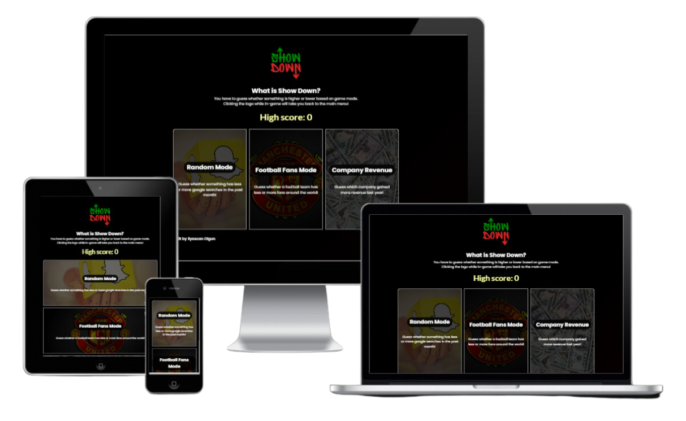

## **Table of contents:**

- [**Site Overview**](#site-overview)
  - [**Planning Stage**](#planning-stage)
    - [**Target Audience**](#target-audience)
    - [**User Stories**](#user-stories)
    - [**Site Aims**](#site-aims)
    - [**How This Will Be Achieved**](#how-this-will-be-achieved)
    - [**Wireframes**](#wireframes)
    - [**Color Scheme**](#color-scheme)
    - [**Typography**](#typography)
  - [**Current Features**](#current-features)
    - [**Main Menu**](#main-menu)
      - [**Main Menu Logo**](#main-menu-logo)
      - [**Main Menu Header**](#main-menu-header)
      - [**Main Menu Game Modes**](#main-menu-game-modes)
    - [**Game Screen**](#game-screen)
      - [**Game Screen Body**](#game-screen-body)
        - [**Game Screen Body First Container**](#game-screen-body-first-container)
        - [**Game Screen Body Second Container**](#game-screen-body-second-containerr)
    - [**Fail Screen**](#fail-screen)

## **Planning Stage** 

### **Target Audience:** 

- People who like testing their luck and also learning facts in the process.
- People who want a break from the real world and have a relaxed game.
- People who want to play a game using only their keyboard.
- Visually impaired people who still want to enjoy the gameplay of a guessing game.

### **User Stories:** 

As a user, I want to:

- Be able to easily navigate through the game and its modes.
- Be able to play the game without any bugs.
- Be able to track my high score.
- I can see the current score I am on while playing the game.
- Be able to use only my keyboard to navigate and play the game.
- Be able to see how I can play the game by looking at the how-to-play guide.

### **Site Aims:** 

- Ensure the site is easy to navigate.
- Keep a record of the user's high score.
- To be an enjoyable distraction to fill the user's extra time.
- To make the users test their luck by guessing the correct score.
- To give the user new knowledge of how many people search topics based on keywords (random mode), how many football fans a team has (football fans mode) and how much revenue a company makes (company revenue mode).
- To be fully accessible to screen readers by utilizing keyboard shortcuts and aria labels.

### **How This Will Be Achieved** 

- The game will be free of charge and no sign-up will be required.
- Ensuring the use of aria labels, alt text and semantic elements are used appropriately.
- The landing page for the user will be the main menu, the user could also have access to this menu using the keyboard shortcut "m", the menu will contain links to:
  - Random mode
  - Football fans mode
  - Company revenue mode
  - My Linkedin profile
  - Project Repository
- Upon user failing a round, they will be navigated to the fail screen and their score will be displayed, on this screen the user has links to:
  - Play again
    - If the score the user failed on, is higher than their recent high score, it will be updated on the game screen.
  - Main menu
    - If the score the user failed on, is higher than their recent high score, it will be updated in the main menu.
  - My Linkedin profile
  - Project Repository
- Providing a clean, simple, appealing and accessible interface.
- By providing a guide on how to use the keyboard shortcuts on the how-to-play screen.

### **Wireframes:** 

To give myself a guide on how to build the structure of my project, I built the following Wireframes:

- Desktop Wireframes:

  - [Main menu](assets/wireframes/show-down-main-menu-desktop.png)
  - [Game screen](assets/wireframes/show-down-game-screen-desktop.png)
  - [Fail screen](assets/wireframes/show-down-fail-screen-desktop.png)

- Mobile Wireframes:

  - [Main menu](assets/wireframes/show-down-main-menu-mobile.png)
  - [Game screen](assets/wireframes/show-down-game-screen-mobile.png)
  - [Fail screen](assets/wireframes/show-down-fail-screen-mobile.png)

### **Color Scheme:** 

Considering the game has a dark theme, I went with lighter colors. The purpose of this was to have the colors pop and be more visible to the user.

The color contrast grid was created using this site [https://contrast-grid.eightshapes.com](https://contrast-grid.eightshapes.com/?version=1.1.0&background-colors=&foreground-colors=%23ffffff%2C%0D%0A%23000000%2C%0D%0A%23170000%2C%0D%0A%23001b01%2C%0D%0A%231da518%2C%0D%0A%230ecb00%2C%0D%0A%23ab1d1d%2C%0D%0A%23d20000%2C%0D%0A%23faffa1%0D%0A%0D%0A%0D%0A%0D%0A%0D%0A%0D%0A&es-color-form__tile-size=compact&es-color-form__show-contrast=aaa&es-color-form__show-contrast=aa&es-color-form__show-contrast=aa18&es-color-form__show-contrast=dnp)

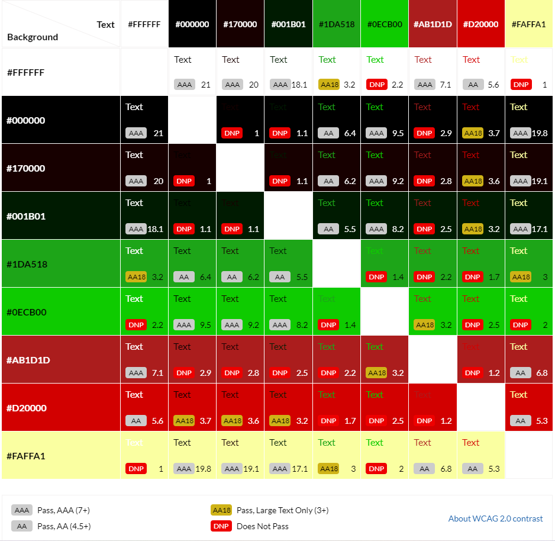

### **Typography:** 

Both fonts used were imported from Google Fonts.

- The Primary font used is "Poppins", this font was chosen because it compliments the game's modern look, also it pops with the game's dark background.
- For the text of the title volumes I used "Lato", the main purpose of using this font was because it's more narrow compared to "Poppins" so for larger numbers it can fit within its container without spilling.

## **Current Features:** 

## **Main Menu** 

The main menu contains the following:

### **Main Menu Logo** 

- The logo shows the name of the game
- The logo does not contain an anchor tag as there are many other ways the user can navigate back to the menu and it is a single page of HTML.

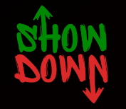

### **Main Menu Header** 

- The main menu header tells the user what the game is and what the goal is.
- The High Score section within the header displays the user's high score, the reason it is on the landing page is that even if the user never played before it gives them the challenge to try and make a high score.
- The How-to-play button when clicked displays a guide on how to play the game and also gives the user the necessary information on how to use the keyboard shortcuts to easily navigate through the game.

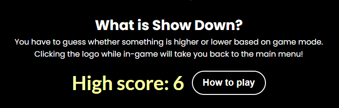

### **Main Menu How To Play** 

- The how-to-play screen contains a how-to-play guide and a keyword shortcut guide.
- The how-to-play guide is short and informative to give the user a quick understanding of the functionality of the game.
- The keyboard shortcut guide contains information on the keys the user has to press and what they do on which screens.

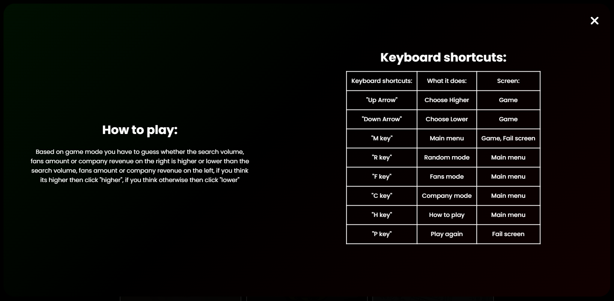

### **Main Menu Game Modes** 

- The main menu has 3 game modes, these include:
  - Random mode, this mode has:
    - Average monthly searches of various keywords in which the user has to guess which is higher or lower.
  - Football(soccer) fans mode, this mode has:
    - Average football fans per team, the user has to guess whether a team has higher or lower fans than another.
  - Company revenue mode, this mode has:
    - The revenue generated per company, the user has to guess which one generated higher or lower revenue.
  - Underneath the game modes, there is a copyright section that consists of my name and a social links section that takes the user either to the project's Repository or to my personal LinkedIn profile.

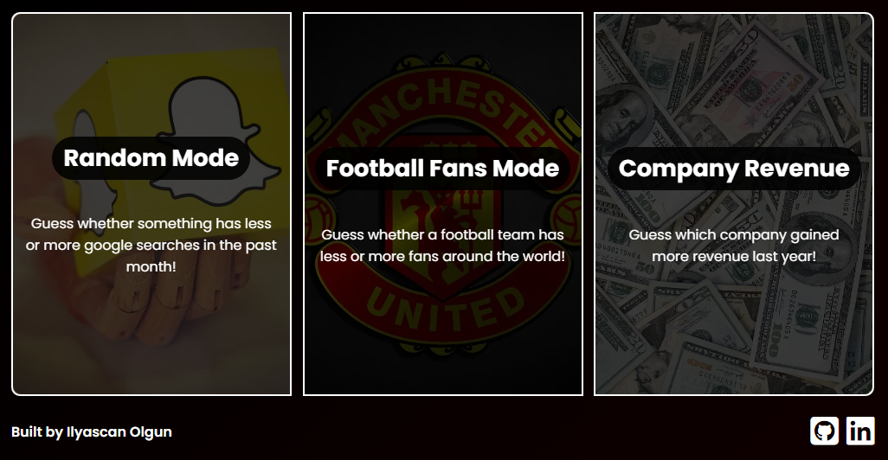

## **Game Screen** 

### **Game Screen Logo** 

- The logo shows the name of the game
- The logo for the game screens purpose is also to be a navigation back to the main menu, the user can do this by either clicking on it or hitting the "m" key on their keyboard.

### **Game Screen Body** 

The game screen body contains the following:

#### **Game Screen Body First Container** 

- The first container's title and title volume are randomly generated when the user clicks on a game mode in the main menu.
- It contains the user's score in the bottom left of the screen and also contains the image owner's link in the bottom right of the screen.

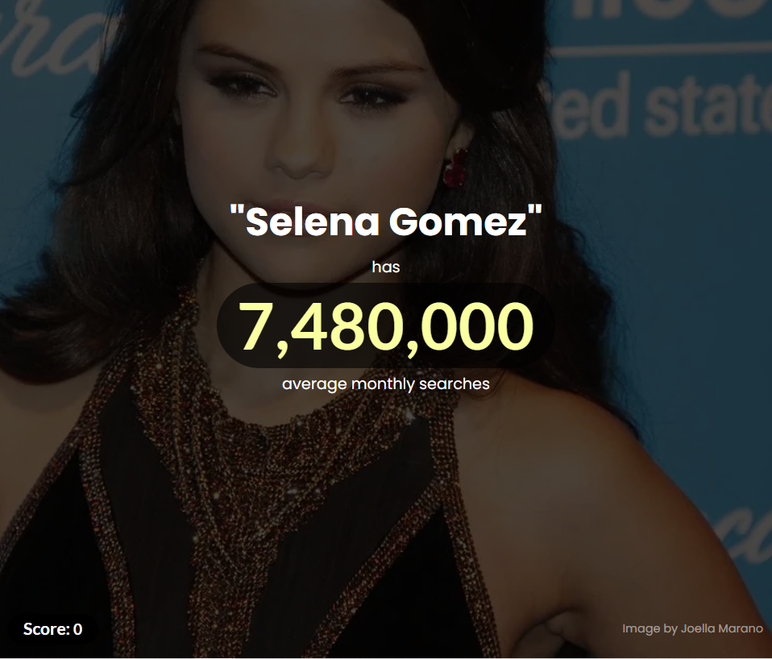

#### **Game Screen Body Second Container** 

- The first container's title is randomly generated as well when the user clicks on a game mode in the main menu.
- It contains the higher and lower buttons which the user can click to reveal if they got the answer right or not, it also contains the user's high score on the bottom left of the screen and the image owner's link in the bottom right of the screen.

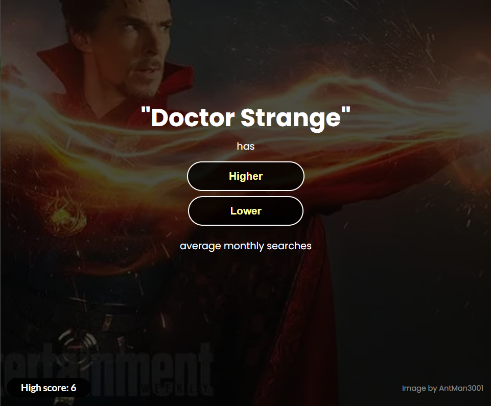

## **Fail Screen** 

The fail screen contains the following:

### **Fail Screen Logo** 

- The logo shows the name of the game.
- The logo for the fail screen does not have an event listener or an anchor tag as there is a main menu button and the user could also just tap the "m" key to navigate back.

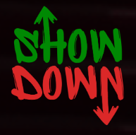

### **Fail Screen Body** 

The fail screen body contains the following:

#### **Fail Screen Body Information** 

- The information section tells the user which score they failed on, and also a complimentary congratulations message, this message changes based on what score they got, for example, scores between 0 - 3 "Oof, better luck next time", this message is a way of telling the user to keep playing and attempt a higher score.

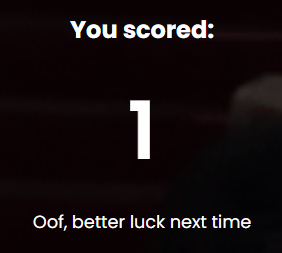

#### **Fail Screen Body Navigation** 

- The fail screen navigation contains a "Play again" button so the player can carry on playing in the game mode they chose before
- The navigation also contains a "Main menu" button which the player can click to navigate back and choose a different game mode.
- The fail screen also has a social links section which holds the project's Repository link and also my personal LinkedIn profile link.
- Underneath the social links, there is another copyright section which has my name.

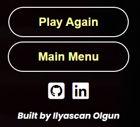
