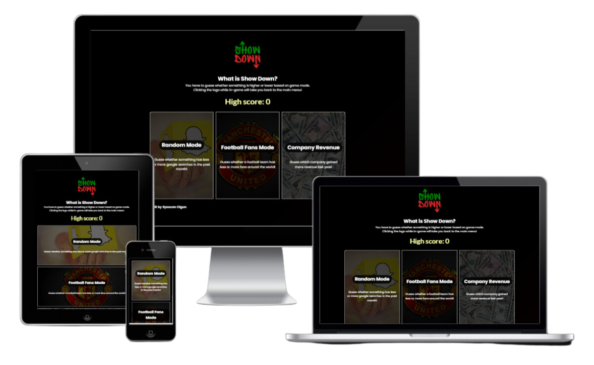
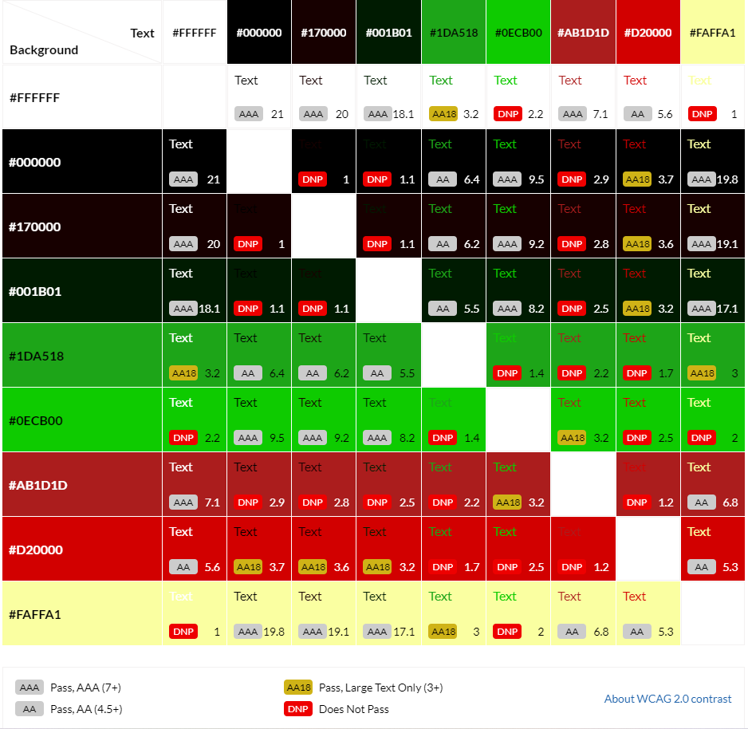

# **Show Down**

## **Site Overview** 

Show Down is a guessing game where the user has to choose either Higher or Lower to move onto the next level, in the context of the "Random Mode", the user has to decide if the given data on the right's search volume is higher or lower than the left sides search volume (this is true on desktop screen, however on mobile screen it will be top and bottom)

The game's addictive nature makes it a perfect break from the outside world. The reason why it is addictive is because the user is trying to get a higher score each time they play and they learn something new as well.

## **Table of contents:**

- [**Site Overview**](#site-overview)
  - [**Planning Stage**](#planning-stage)
    - [**Target Audience**](#target-audience)
    - [**User Stories**](#user-stories)
    - [**Site Aims**](#site-aims)
    - [**How This Will Be Achieved**](#how-this-will-be-achieved)
    - [**Wireframes**](#wireframes)
    - [**Color Scheme**](#color-scheme)
    - [**Typography**](#typography)
  - [**Current Features**](#current-features)

## **Planning Stage** 

### **Target Audience:** 

- People who like testing their luck and also learning facts in the process.
- People who want a break from the real world and have a relaxed game.
- People who want to play a game using only their keyboard.
- Visually impaired people who still want to enjoy the gameplay of a guessing game.

### **User Stories:** 

As a user, I want to:

- Be able to easily navigate through the game and its modes.
- Be able to play the game without any bugs.
- Be able to track my high score.
- I can see the current score I am on while playing the game.
- Be able to use only my keyboard to navigate and play the game.
- Be able to see how I can play the game by looking at the how-to-play guide.

### **Site Aims:** 

- Ensure the site is easy to navigate.
- Keep a record of the user's high score.
- To be an enjoyable distraction to fill the user's extra time.
- To make the users test their luck by guessing the correct score.
- To give the user new knowledge of how many people search topics based on keywords (random mode), how many football fans a team has (football fans mode) and how much revenue a company makes (company revenue mode).
- To be fully accessible to screen readers by utilizing keyboard shortcuts and aria labels.

### **How This Will Be Achieved** 

- The game will be free of charge and no sign-up will be required.
- Ensuring the use of aria labels, alt text and semantic elements are used appropriately.
- The landing page for the user will be the main menu, the user could also have access to this menu using the keyboard shortcut "m", the menu will contain links to:
  - Random mode
  - Football fans mode
  - Company revenue mode
  - My Linkedin profile
  - Project Repository
- Upon user failing a round, they will be navigated to the fail screen and their score will be displayed, on this screen the user has links to:
  - Play again
    - If the score the user failed on, is higher than their recent high score, it will be updated on the game screen.
  - Main menu
    - If the score the user failed on, is higher than their recent high score, it will be updated in the main menu.
  - My Linkedin profile
  - Project Repository
- Providing a clean, simple, appealing and accessible interface.
- By providing a guide on how to use the keyboard shortcuts on the how-to-play screen.

### **Wireframes:** 

To give myself a guide on how to build the structure of my project, I built the following Wireframes:

- Desktop Wireframes:

  - [Main menu](images/readme/show-down-main-menu-desktop.png)
  - [Game screen](images/readme/show-down-game-screen-desktop.png)
  - [Fail screen](images/readme/show-down-fail-screen-desktop.png)

- Mobile Wireframes:

  - [Main menu](images/readme/show-down-main-menu-mobile.png)
  - [Game screen](images/readme/show-down-game-screen-mobile.png)
  - [Fail screen](images/readme/show-down-fail-screen-mobile.png)

### **Color Scheme:** 

Considering the game has a dark theme, I went with lighter colors. The purpose of this was to have the colors pop and be more visible to the user.

The color contrast grid was created using this site [https://contrast-grid.eightshapes.com](https://contrast-grid.eightshapes.com/?version=1.1.0&background-colors=&foreground-colors=%23ffffff%2C%0D%0A%23000000%2C%0D%0A%23170000%2C%0D%0A%23001b01%2C%0D%0A%231da518%2C%0D%0A%230ecb00%2C%0D%0A%23ab1d1d%2C%0D%0A%23d20000%2C%0D%0A%23faffa1%0D%0A%0D%0A%0D%0A%0D%0A%0D%0A%0D%0A&es-color-form__tile-size=compact&es-color-form__show-contrast=aaa&es-color-form__show-contrast=aa&es-color-form__show-contrast=aa18&es-color-form__show-contrast=dnp)

### **Typography:** 

Both fonts used were imported from Google Fonts.

- The Primary font used is "Poppins", this font was chosen because it compliments the game's modern look, also it pops with the game's dark background.
- For the text of the title volumes I used "Lato", the main purpose of using this font was because it's more narrow compared to "Poppins" so for larger numbers it can fit within its container without spilling.

## **Current Features:** 
