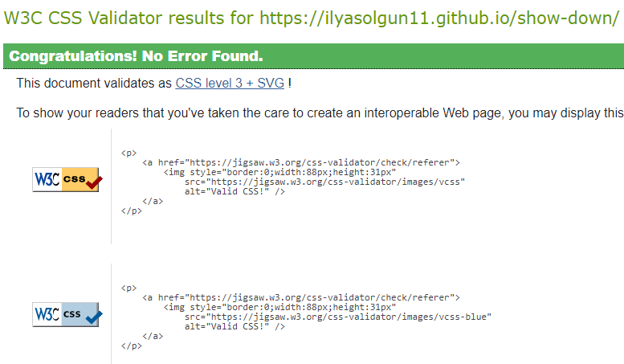

# **Table of Contents**

- [**During Development Testing**](#during-development-testing)
  - [**Manual Testing**](#manual-testing)
  - [**Bugs and Fixes**](#bugs-and-fixes)
- [**Post Development Testing**](#post-development-testing)
  - [**Validators**](#validators)
    - [**HTML**](#html)
    - [**CSS**](#css)
    - [**JavaScript**](#javascript)
  - [**Lighthouse Scores**](#lighthouse-scores)
    - [**Desktop Version**](#desktop-version)
    - [**Mobile Version**](#mobile-version)
  - [**Accessability**](#accessability)

## **During Development Testing:**

While i was building the game, i was manually testing the responsiveness and functionality in the following ways:

- Manually testing each section for appearance and responsiveness using a live server (extension on VSCode).
- After i published my project through github pages i asked fellow student's at slacks "peer-code-review" channel to see if they can find any bugs.
- I published a post on LinkedIn and asked my network of 400+ developers to review, no issues were stated in the comments.

### **Manual Testing**

During testing I used 5 different browsers to ensure cross-compatibility. The browsers used were:

- Chrome
- Firefox
- Firefox developer edition
- Opera GX
- Microsoft Edge

For all the browsers i used their own devtools to simulate a mobile screen and no issues were found.

### **Bugs and Fixes:**

1. **Intended Outcome** - For once the user clicks on either higher or lower, for the content on the right side to shift over to the left side, and also add a new content on the right side.
   - **_Issue Found:_**
     - The right sides content did not because i did not set new content for it after the content on the right shifted over to the left.
   - **_Solution:_**
     - Once the content on the right (currentArray[randomNumber2].title and currentArray[randomNumber2].titleVolume) shifted over to the left, i once again randomized and set a new value for the randomNumber2 and used a while loop to insure it was not the same as before, after that i set the values for the content on the right side to the newly randomized randomNumber2.
1. **Intended Outcome** - For the array being displayed to change when a user selects a different game mode.
   - **_Issue Found:_**
     - I did not have a global variable to edit to the newly selected game mode so that it could be used to display the selected game modes data from data.js.
   - **_Solution:_**
   - I added a global variable called currentArray and set its value to nothing, i then created a function, once the user clicks on a game mode, depending on which one they clicked the value of currentArray would change to either searchData (data for random mode), fansData (data for football fans mode) and revenueCap (data for company revenue mode). Setting the currentArray value like this i would not have to change any of the game logic itself and it runs smoothly on every mode.
1. **Intended Outcome** - For the users high score to be saved and displayed in the main menu and game screen
   - **_Issue Found_**
     - I was not using localStorage which i was introduced to by searching up ways of saving data easily.
   - **_Solution_**
     - I quickly learned the basics of saving data to localStorage and i simply created a function that checks if the users score at failing the game is higher or lower than their previous high score, if its higher i would set the high score to be the new high score and also use localStorage.setItem('highScore', highScore) to save it to the users local storage, this way even if the user refreshes the game or comes back a few days later to play again their high score would be displayed.
1. **Intended Outcome** - For the GIF to display once the user failed a round and navigated to the fail screen
   - **_Issue Found_**
     - Initially when the fail screen loads, the GIF would not display for 1-2 seconds and because the background of fail screen was set to the GIF, the user would be able to see the game itself and it was not appealing in any way.
   - **_Solution_**
     - I would initially set the background to black using css, and so when the user enters the fail screen, even if they do not see the GIF for the first few seconds, they would see a black background which is more appealing and less broken looking then being able to see the game itself in the background.
1. **Intended Outcome** - For when the user gets the answer right or wrong, i wanted to display indicators to tell them of the result instead of moving onto the next round or displaying the fail screen, for this i used either a check or x icon in the middle of the screen and also either a green or red background that would display, but i could not get it to display after the number iteration finished and disappear after the next round started.
   - **_Issue Found_**
     - I was not using a timeout function to display then hide the indicators.
   - **_Solution_**
   - I used a setTimeout function inside the iteration loops if statement, once the iteration finished i would display the indicators for 1 second using milliseconds intervals (1000) and then in the else statement of the iteration loops if statement i would set the indicators display to none, i would make this animation smooth by first setting a transition the indicators opacity in the CSS file so that it would smoothly display and then disappear.

## **Post Development Testing**

### **Validators**

#### **HTML** - [https://validator.w3.org/nu/#textarea)

Returned no errors when checking the HTML document, i got a few "info" warning because i used a self closing tag with a trailing slash. I am unable to remove then because my VSCode prettier extension puts then back when i do.

#### **CSS** - [https://jigsaw.w3.org/css-validator/)

Returned no errors from css file using direct and URL input. However there are a few warnings telling me that using background-clip to text method has been deprecated, But when i checked all browsers to see cross-compatibility of my game i noticed no issues with the background color being clipped to the header.

#### **JavaScript** - [https://jshint.com/)

Since i have 2 JavaScript folders i pasted both of them into the JavaScript Validator, the reason for this was because the game only works if the files are combined, I managed to achieve this by adding both JavaScript files in script tags in my HTML file. If i only add 1 file into the JavaScript validator for example my script.js file, i get errors mentioning that i have 3 undefined variables; searchData, fansData and revenueCap. These variables are arrays in the data.js file that i am extracting as mentioned above by having them in the body of my HTML file. Other than this there is no errors returned.

Also in the configure section in JSHint i turned on "New JavaScript features (ES6)" so the validator recognizes ES6 code.

The final metrics returned by JSHint are:

- There are 39 functions in this file.
- Function with the largest signature take 3 arguments, while the median is 0.
- Largest function has 23 statements in it, while the median is 4.
- The most complex function has a cyclomatic complexity value of 13 while the median is 1.

### **Lighthouse Scores**

Test conditions

- I did all lighthouse tests in incognito mode to avoid interface from extensions.
- I ran the tests for both mobile and desktop.

#### **_Desktop Version:_**

#### **_Mobile Version:_**

### **Accessability**

In addition to the lighthouse accessibility score, I also used [WAVE - Web accessibility evaluation tool](https://wave.webaim.org/extension/) to check my pages for accessibility, and i got no errors.

[return to README.md](README.md)
